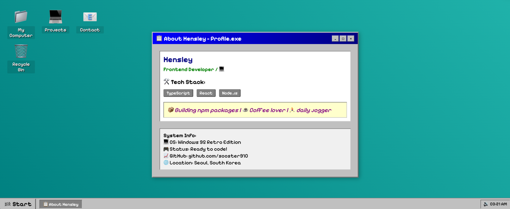

<h1 align="center"> 𝙃𝙚𝙡𝙡𝙤, 𝙄'𝙢 Hensley</h1>  

🔗 GraphQL newbie
📦 Exploring npm ecosystem
💡 𝑭𝒓𝒆𝒔𝒉 𝒂𝒊𝒓, 𝒇𝒓𝒆𝒔𝒉 𝒄𝒐𝒅𝒆, 𝒇𝒓𝒆𝒔𝒉 𝒊𝒅𝒆𝒂𝒔.
 

 

## My Main Tech Stack:
   
 

## 🔝 Top Open Source Contributions

## Things I Write About

- [Module Subscription, ContextAPI](https://www.hyunsujoo.wiki/posts/global_state_thought/)
- [TypeScript Freshness](https://www.hyunsujoo.wiki/posts/freshness/)

## 𝗖𝘂𝗿𝗿𝗲𝗻𝘁𝗹𝘆 𝘄𝗼𝗿𝗸𝗶𝗻𝗴 𝗼𝗻 

## GitHub Stats:
 

## Algorithm Learning Path: Consistency Through LeetCod
 
